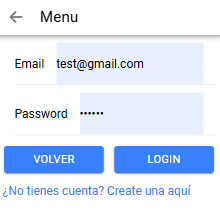
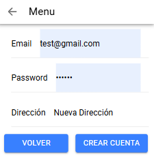
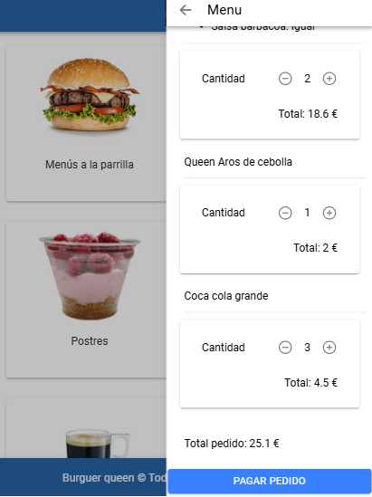
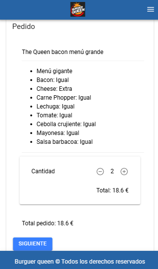
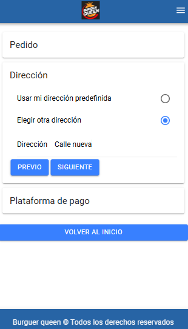
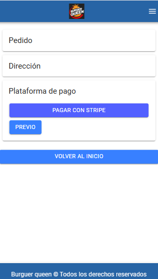
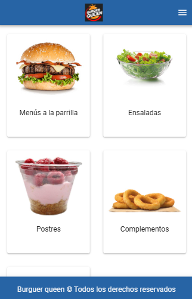
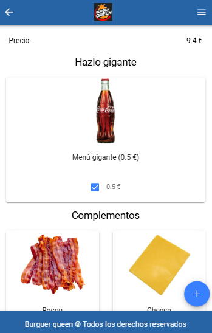
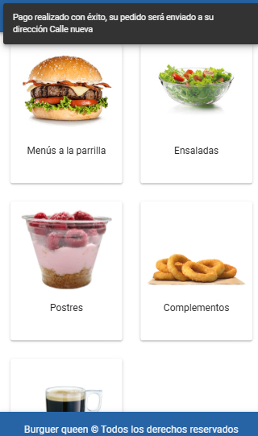

# Burguer Queen App

Aplicación móvil desarrollada con **Ionic** y **Angular** que simula la experiencia de un restaurante digital. Los usuarios pueden explorar productos, agregar a su orden, y realizar pagos simulados con tarjeta utilizando Stripe. Incluye autenticación y una integración backend real mediante Docker.

## Funcionalidades principales

- Crear órdenes con múltiples productos.
- Registro e inicio de sesión de usuarios.
- Simulación de pagos con tarjeta mediante `@capacitor-community/stripe`.
- Si el usuario no ha iniciado sesión, **no podrá pagar** su orden.
- Visualización del historial de pedidos (dependiendo del backend).
- Comunicación con backend vía API REST (necesaria para recursos y pagos).
- **El backend se ejecuta en Docker**, indispensable para la funcionalidad total.

## Tecnologías y dependencias principales

### Frontend
- **Ionic Framework**
- **Angular**
- **TypeScript**
- **SCSS**
- **@capacitor-community/stripe** (para integración de pagos)
- **@ionic/storage** (para guardar sesión localmente)
- **Capacitor**

### Backend
- Node.js
- Stripe
- Contenedorizado con **Docker**

---

## Instalación y ejecución local

### 1. Clonar el repositorio

```bash
git clone https://github.com/tu_usuario/restauranteApp.git
cd restauranteApp ```

### 2. Instalar dependencias del frontend

```bash
npm install ```

### 3. Levantar el backend (Docker)

```bash
cd backend
docker-compose up --build ```

### 4. Ejecutar la app

```bash
ionic serve ```

##Registro y autenticación

El usuario debe registrarse o iniciar sesión para crear y pagar órdenes.
Los tokens de sesión se guardan localmente en @ionic/storage.

##Capturas de Pantallas










##Creditos
Aprende Ionic de forma práctica
Impartido por Disco Duro de Roer — Desarrollador, youtuber, streamer y profesor particular.
